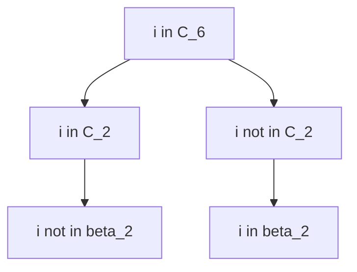
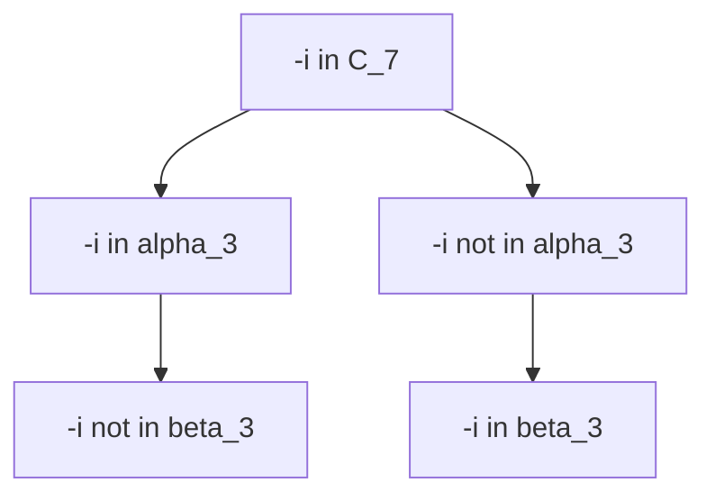
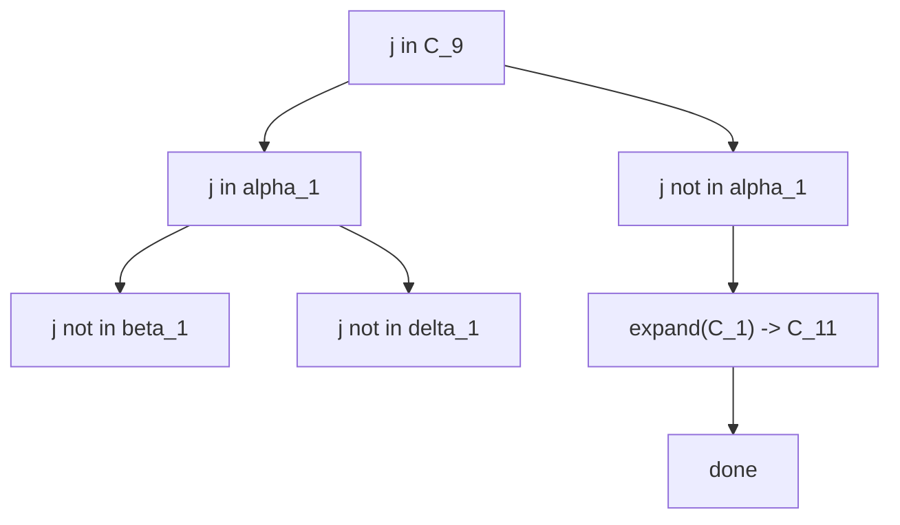
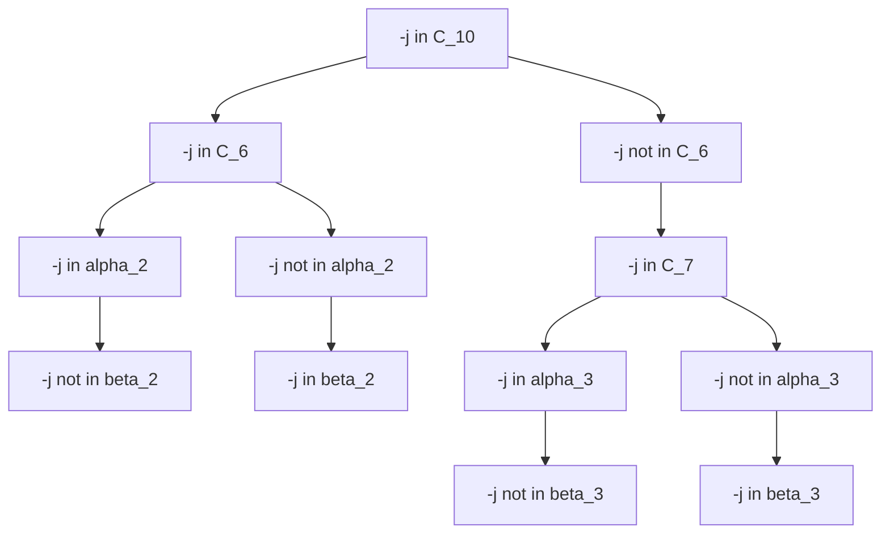
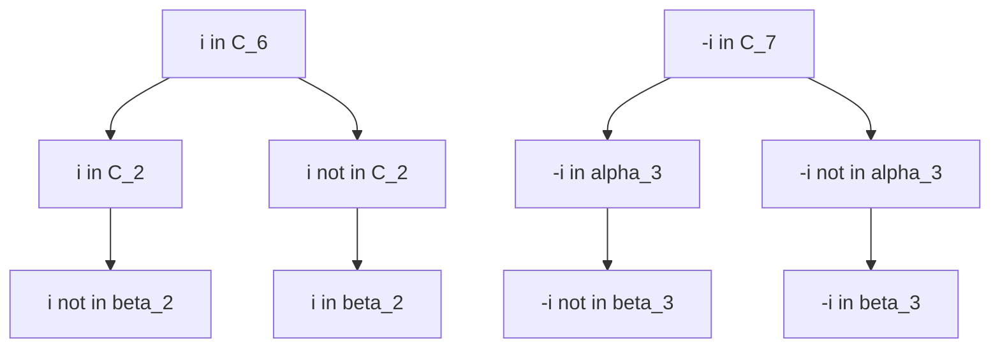
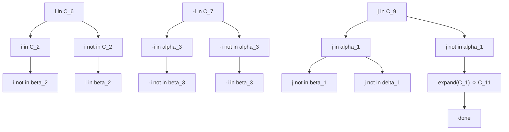
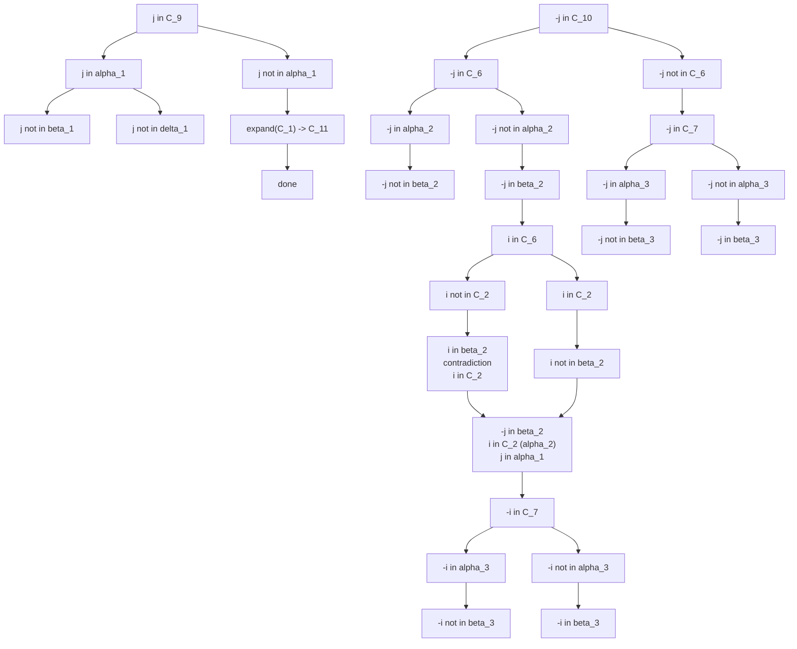

Tree for $i$

Tree for $-i$

Tree for $j$

Tree for $-j$

Now we know all of the potential locations for i, -i, j, and -j
Let's combine some trees

Combine i and -i

Not much can be said
Add the j-tree

drats, no real info can be gained, alright combine them all

